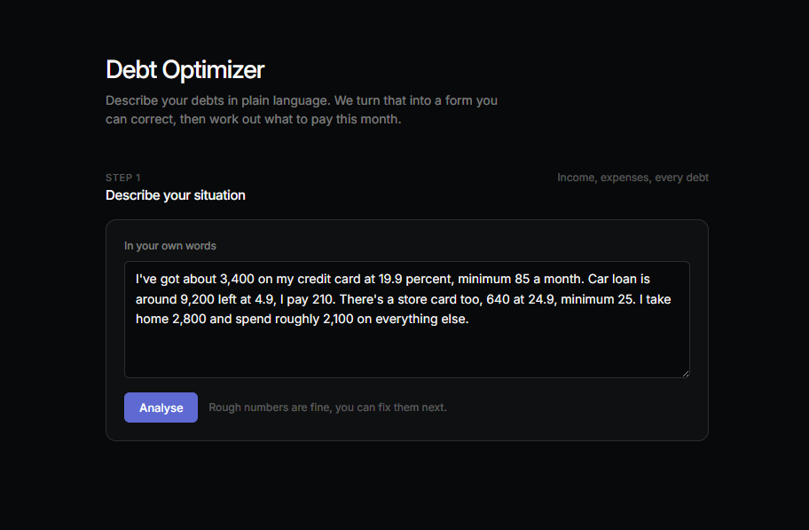
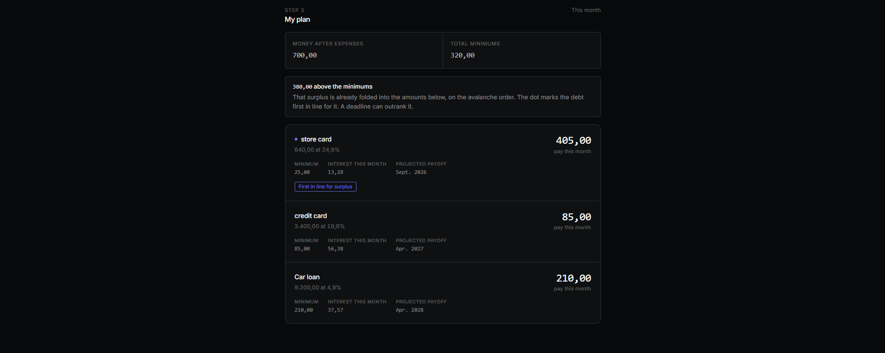

# DebtOptimizer

Tell it what you owe in plain English. It tells you where your money goes this month.

**[debtoptimizer.onrender.com](https://debtoptimizer.onrender.com)** — free tier, first load takes ~30s to wake.



---

## The problem

Most people pay the minimum because that is what the bill says. If the minimum is below the monthly interest, the balance grows while you pay. Pay €50/month on €3,000 at 20% and in ten years you still owe €3,000, having paid €6,000.

Which debt to attack is also not obvious. A euro against a 20% card saves 20 cents a year, forever. The same euro against a 5% loan saves 5 cents. Balance does not matter — a €500 card at 20% beats a €50,000 loan at 5% for the next euro.

That is the **avalanche method**. It is provably optimal for minimising interest, and it is what this app does by default.



---

## What it does

| | |
|---|---|
| **Reads plain text** | *"about 3k on my card and a car loan, 10 grand at 5 percent"* → structured data. What you did not say comes back empty and gets asked, never guessed. |
| **Handles deadlines** | *"car gone by March"* reserves what that costs per month, then avalanches the rest. If March is impossible it gives you the earliest date that is not. |
| **Prices your choices** | Honouring a deadline costs interest. It tells you how much, so you can decide. |
| **Three strategies** | Avalanche (cheapest), snowball (smallest first), target (one specific debt). Set it yourself or let the AI read it from how you describe things. |
| **Says no honestly** | If your minimums exceed your income, it says so and shows what the budget covers. |

---

## Decisions

**No solver.** Deadlines look like constrained optimisation. They are not — each one has a fixed monthly requirement, so you subtract them and the remainder has one obvious best use. Reserve, then sort. Knowing when *not* to reach for OR-Tools was the point.

**No CQRS.** Two entities, no read/write asymmetry, no scale pressure. It would have been decoration.

**The AI never does maths.** It converts sentences to JSON and classifies intent. Every number comes from C#. Models are unreliable at arithmetic and reliable at form-filling, so it only does the second. Failed calls return 502, never a plausible-looking empty result.

**Nullable extraction DTOs.** `decimal?`, not `decimal` — 0% loans exist, so 0 and "not stated" have to be different things. The entire gap-detection feature depends on that.

**One interface.** `IDebtExtractor`, because swapping Gemini for Azure OpenAI is a real possibility. `PaymentPlanService` has none, because nothing will ever implement it twice.

**Pure calculation core.** `PaymentPlanService` has no DbContext, no HTTP, no clock. It survived a full SQL Server → PostgreSQL swap without a single test changing.

---

## Stack

ASP.NET Core 10 · PostgreSQL · EF Core · Gemini · React + TypeScript · Docker · GitHub Actions · Render

Three-stage Dockerfile — Node builds the frontend, .NET SDK publishes the API, runtime image gets both. One deployment, no CORS. Push to master runs 28 tests; deploy only fires if they pass.

---

## Run it

Needs `DB_PASSWORD` and `GEMINI_API_KEY` in a `.env` file at the repo root.

```bash
docker compose up -d --build   # → localhost:5154
dotnet test tests/DebtOptimizer.Tests
```

---

## API

```
POST /api/extract              text → structured data + follow-up questions
POST /api/infer-strategy       text → strategy + reason
POST /api/profiles/plan        request → plan (stateless)
POST /api/profiles             save
GET  /api/profiles/{id}        read
POST /api/profiles/{id}/plan   plan from saved profile
```

---

## Not done

- **No integration tests.** All 28 cover the calculation in isolation. Nothing crosses the HTTP or DB boundary — which is how an enum-serialisation bug once reached production.
- **No staging.** Gated on CI, but straight to prod.
- **Free-tier database.** Expires. Fine for a demo.
- **Savings.** Debts first. Once savings compete for the same euro it gets harder — an emergency buffer prevents future 20% debt, which can beat paying down 5% debt today.
